# Witchub | A DBMS (CSE361) Project

This repository contains the source code for the project Witchub. Witchub is an e-commerce website that deals with buying and selling of artworks and craftworks, built under Database Management System course.

## Tech Details:

|||
| --: | -- |
| **Languages** | Java, HTML5, CSS3, Javascript |
| **Framework** | Spring Boot, Bootstrap5 |
| **Template Engine** | Thymeleaf |
| **Backend** | MySQL |
| **Encryption** | Jasypt |

## Video Demo:
For the demo link click [here](https://drive.google.com/file/d/1I2cWdr9AZu_RsGuS8x9NGe45jJxr6Rdg/view?usp=sharing).

## Schemas:
- Tables: Normalized upto BCNF
- No. of Tables: 15
- Total Attributes: 82

## Roles:
- Admin
- Buyer
- Seller

## Some Snapshots:

### Homepage
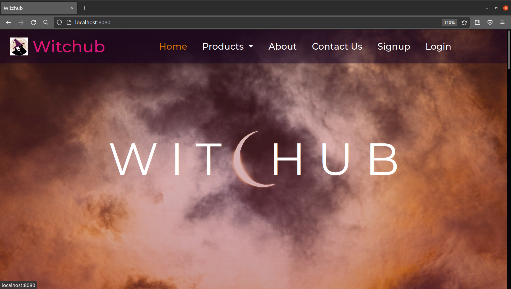

### Login Page
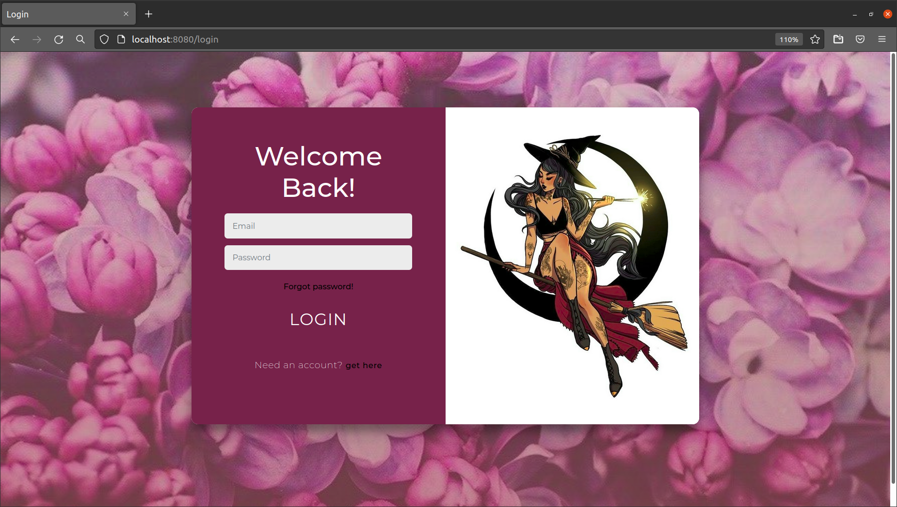

### Products
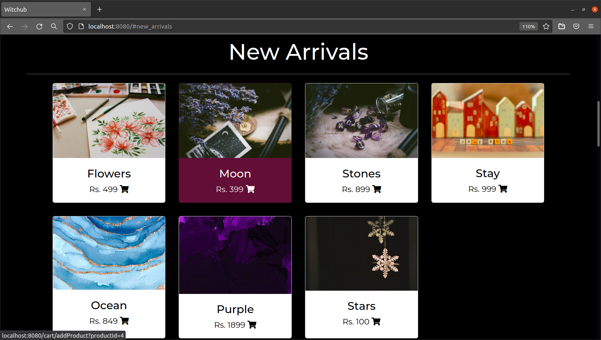

### Individual Product View
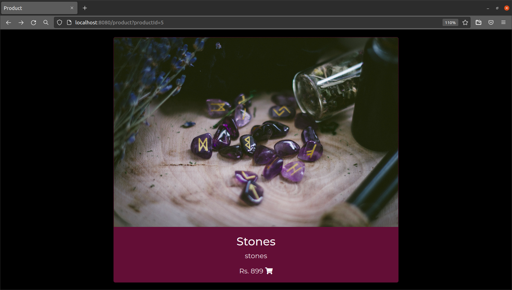

### Buyers'
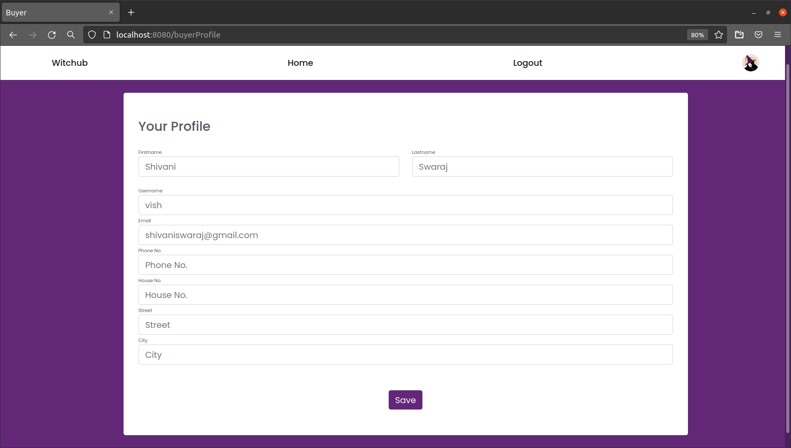
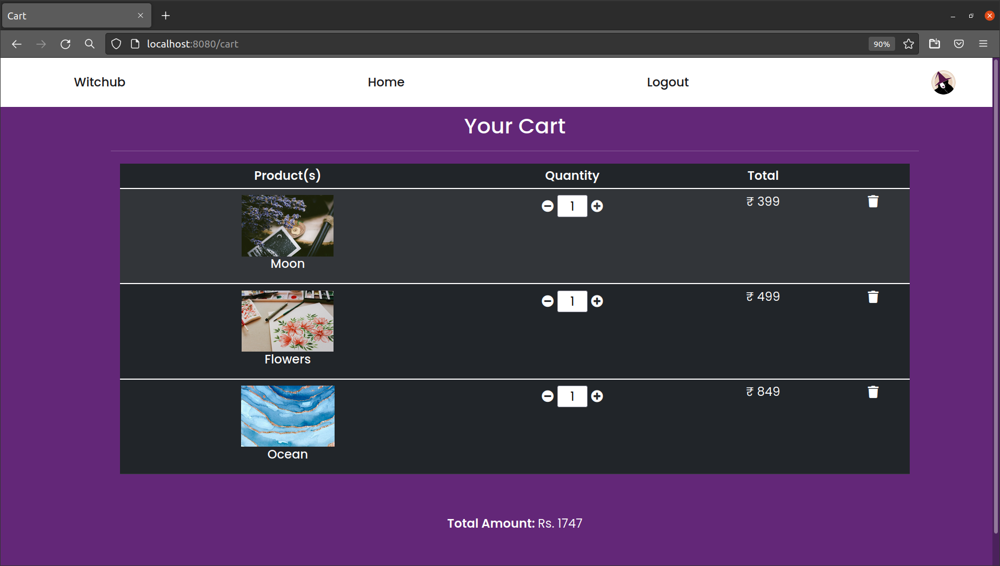
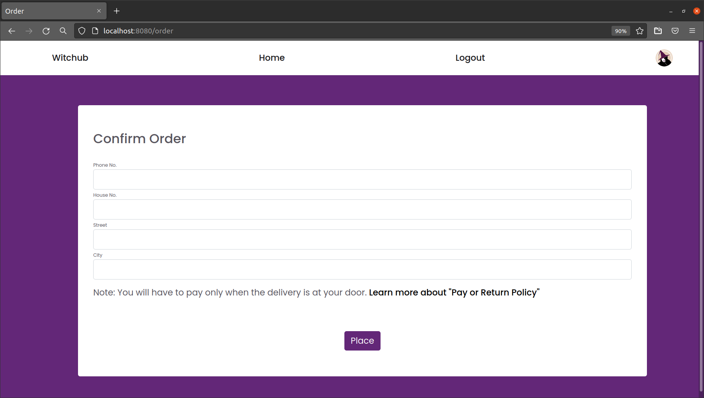

### Seller's
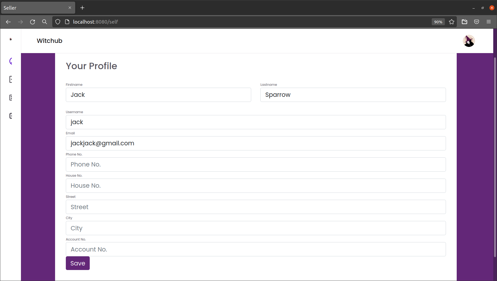
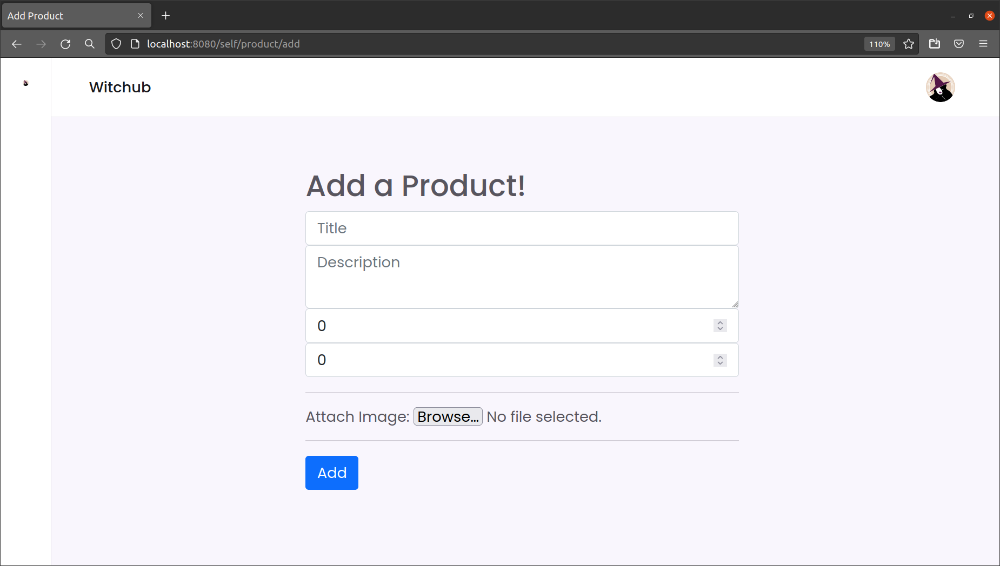
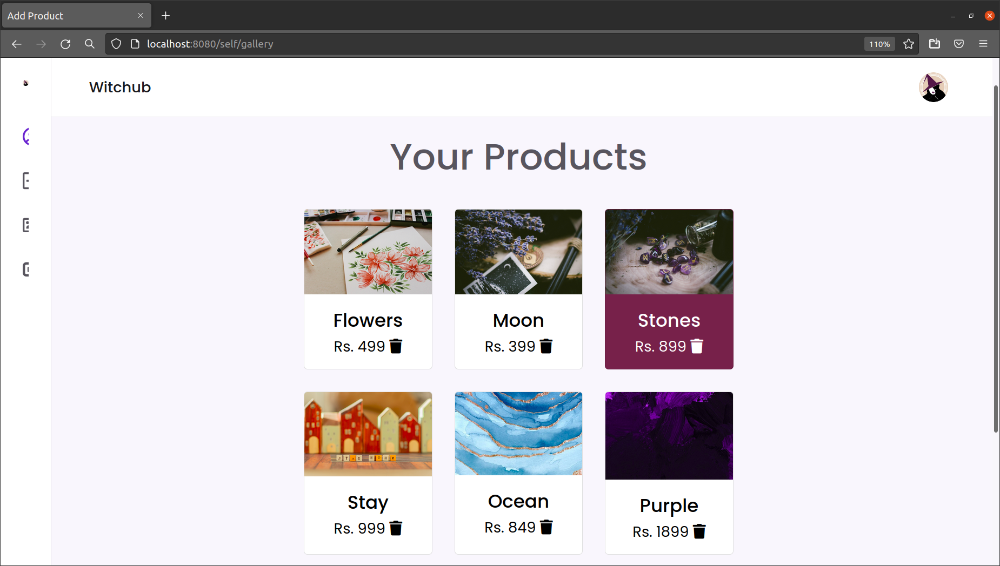

### Contact Us
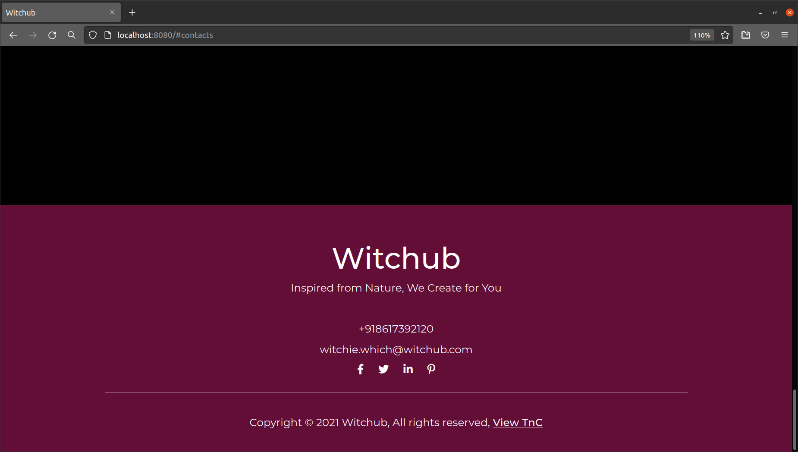
